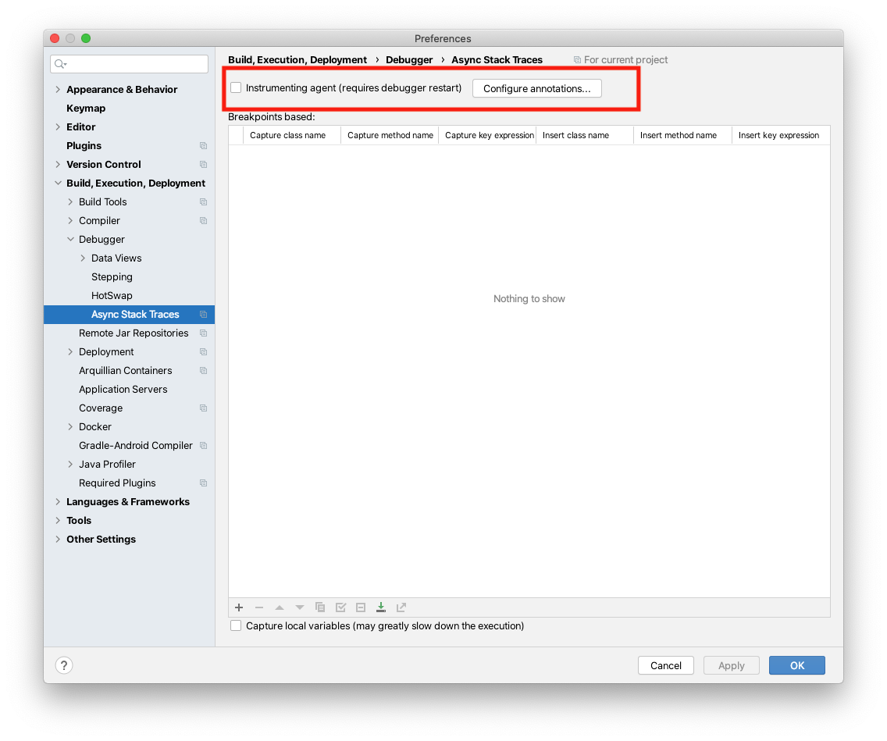

# futuristic-feline


futuristic-feline is a library for detecting blocking Java futures at runtime. It is inspired by the excellent [BlockHound](https://github.com/reactor/BlockHound).

Writing asynchronous code is hard and blocking futures can lead to thread pool starvation. This has been a common source of incidents at Spotify and we monitor our services with this library to detect and fix services at risk.

## What does it do?

futuristic-feline detects when `Future.get()`, `CompletableFuture.get`, or `CompletableFuture.join` is called in a blocking fashion. That is, if they are called before being completed. futuristic-feline does this by injecting a check into these methods using byte code manipulation, and provides a callback function where you can act on any blocking calls, for example by collecting metrics or failing.

For example, the following will print to stdout on any blocking calls:

```java
Feline.addConsumerLast(System.out::println);
```

or throw an exception:

```java
Feline.addConsumerLast(call -> {throw new RuntimeException(call);});
```

To get started, add a dependency on:

```xml
    <dependency>
      <groupId>com.spotify</groupId>
      <artifactId>futuristic-feline</artifactId>
      <version>$VERSION</version>
    </dependency>
```

## Metrics integration

It is often useful to create a metric for the rate of blocking calls. At Spotify we have built this into our service framework using [semantic-metrics](https://github.com/spotify/semantic-metrics).

If you use a different metrics collection framework, it should be straight-forward to integrate futuristic-feline. We're happy to accept contributions for other framework integrations.

### semantic-metrics integration

Add a dependency on:

```xml
    <dependency>
      <groupId>com.spotify</groupId>
      <artifactId>futuristic-feline-semantic-metrics</artifactId>
      <version>$VERSION</version>
    </dependency>
```

Then register the `MetricConsumer` with `Feline`:

```java
SemanticMetricRegistry registry = new SemanticMetricRegistry()
Feline.addConsumerLast(new MetricsConsumer(registry));
```

This will create a meter tagged with `what: blocking-calls` and `call`
referring to the class and method name that called the blocking
`Future` or `CompletableFuture` method.

You can customize how the caller is identified by
injecting a custom `CallFinder` to the `MetricsConsumer` - take a look at the
code in `com.spotify.feline.MetricsConsumer` for more detail.

## JUnit integration

Feline can also be used to detect blocking futures in your tests. We provide integration with Junit 4 and 5.

### JUnit 4

When using JUnit 4, you can add automatic detection of blocking calls to all tests by adding a dependency on:

```xml
    <dependency>
      <groupId>com.spotify</groupId>
      <artifactId>futuristic-feline-junit4</artifactId>
      <version>$VERSION</version>
      <scope>test</scope>
    </dependency>
```

And registering `FelineRunListener` with your JUnit runs. One way of doing this is with the Maven Surefire plugin:

```xml
      <plugin>
        <artifactId>maven-surefire-plugin</artifactId>
        <version>2.22.2</version>
        <configuration>
          <properties>
            <property>
              <name>listener</name>
              <value>com.spotify.feline.FelineRunListener</value>
            </property>
          </properties>
        </configuration>
      </plugin>
```

This will inject a `RunListener` that will fail tests on any blocking calls.

### JUnit 5

When using JUnit 5 (not vintage), you can add automatic detection of blocking calls to all tests simply by adding a dependency on:

```xml
    <dependency>
      <groupId>com.spotify</groupId>
      <artifactId>futuristic-feline-junit5</artifactId>
      <version>$VERSION</version>
      <scope>test</scope>
    </dependency>
```

This will inject a `TestExecutionListener` that will fail tests on any blocking calls.

### Ignoring blocking calls in tests

It's sometimes convenient to have blocking calls within your test methods themselves. In this case, you can ignore blocking calls by annotating your method:

```java
  @Test
  @IgnoreBlocking
  public void ignoreBlockingJoin() {
    final CompletableFuture<Void> future = CompletableFuture.runAsync(RUNNABLE);

    // blocking, but works since we're ignoring blocking calls
    future.join();
  }
```

Note that this will still fail as `@IgnoreBlocking` only applies to the annotated method:

```
  @Test
  @IgnoreBlocking
  public void indirectIgnoreBlockingJoin() {
    blockingCall();
  }

  private void blockingCall() {
    final CompletableFuture<Void> future = CompletableFuture.runAsync(RUNNABLE);

    future.join();
  }
```


## Development notes

### Test failures when IntelliJ's debugger is attached

If you are working on futuristic-feline and have a need to attach IntelliJ's debugger to a test, you might find that all tests that depend on applying FelineTransformer are failing for mysterious reasons.

It seems that in some versions of IntelliJ, the debugger will attach an agent of its own to the Java process that it launches to run tests, which interferes with how Feline sets up its own agent.

This can be easily addressed by opening IntelliJ's settings and under Build, Execution, Deployment > Debugger > Async Stack Traces, uncheck the box for "Instrumenting Agent":



References:
- https://intellij-support.jetbrains.com/hc/en-us/community/posts/360000166640-Running-Debug-in-Java-can-t-find-CaptureAgent
- https://www.jetbrains.com/help/idea/async-stacktraces.html


## Code of Conduct

This project adheres to the [Open Code of Conduct][code-of-conduct]. By participating, you are expected to honor this code.

[code-of-conduct]: https://github.com/spotify/code-of-conduct/blob/master/code-of-conduct.md
